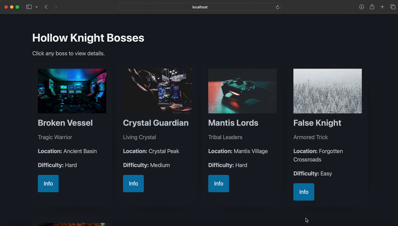

# WEB103 Project 2 - Hollow Knight Boss List

Submitted by: **Noor Al Azzawi**

About this web app: **This web app displays a list of Hollow Knight bosses. The data is stored in a PostgreSQL database (Supabase) and retrieved through an Express backend API. Users can view all bosses and click on any boss to see a detailed page with additional information.**

Time spent: **6** hours

## Required Features

The following **required** functionality is completed:

- [x] **The web app uses only HTML, CSS, and JavaScript without a frontend framework**
- [x] **The web app is connected to a PostgreSQL database, with an appropriately structured database table for the list items**
  - [x] **NOTE: Your walkthrough added to the README must include a view of your Render dashboard demonstrating that your Postgres database is available**
  - [x] **NOTE: Your walkthrough added to the README must include a demonstration of your table contents. Use the psql command 'SELECT * FROM tablename;' to display your table contents.**

## Optional Features

The following **optional** features are implemented:

- [ ] The user can search for items by a specific attribute

## Additional Features

The following **additional** features are implemented:

- [x] A separate detail page for each boss using dynamic routing (`/bosses/:id`)
- [x] A styled card layout for each boss
- [x] A custom 404 page for invalid routes

## Video Walkthrough

Here's a walkthrough of implemented required features:

GIF created with **Kap**

## Notes

One challenge was replacing the in-memory array used in Project 1 with a PostgreSQL database. Another challenge was configuring the Express server to connect to Supabase using environment variables and ensuring the API routes correctly fetched data from the database.

## License

Copyright 2026 Noor Al Azzawi

Licensed under the Apache License, Version 2.0 (the "License"); you may not use this file except in compliance with the License.
